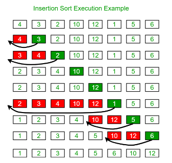

# T2A1-B

## Identify and explain the workings of TWO sorting algorithms and discuss and compare their performance/efficiency (i.e. Big O).
## Merge Sort
Merge Sort is a divide-and-conquer algorithm that efficiently sorts an array by recursively dividing it into smaller subarrays, sorting each half and then merging the sorted halves back together.  This process continues until the whole array is sorted.  

### Steps
1. Divide:
    - The array is recursively split into two halves until each sub-array contains only a single element, as a single element is trivially sorted. This results in a series of sub-arrays of one size.  

2. Conquer:
    - This is where the merging takes place.  During merging, two adjacent sorted arrays are combined into a single sorted array. This is done by repeatedly comparing the smallest unmerged elements of each sub-array and selecting the smaller element, placing it into a temporary array. This continues until one of the sub-arrays is exhausted. At this point, any remaining elements in the other sub-array are directly copied into the temporary array, as they are already sorted.  

3. Combine:
    - The last step involves combining these sorted arrays into larger and larger segments until the entire array is sorted. This process ensures that at each stage, the arrays being merged are sorted, leading to the final sorted array.

**Merge Sort Illustration**  

  

### Efficiency (Big O Notation)
1. Time Complexity:
    - The **Best Case, Average Case and Worst Case**: *O(n log n)*  
        * Due to Merge Sorts' divide and conquer approach, it consistently has a time complexity of *O(n log n) in all cases.  
            - **Divide:** The array is divided into two halves which is done in *O(log n)* stages(each time dividing the array size by two).
            - **Conquer and Combine:** Sorting and merging the divided arrays take *O(n)* time for each level of the recursion, as merging two sorted arrays requires comparing each element from both arrays once.  

Regardless of the initial order of the array, merge sort will always perform *O(n log n)* operations.  

2. Space Complexity:  
    - Merge Sort needs O(n) extra space to store the divided parts of the array and the merge results.  

## Insertion Sort  
Insertion sort is a simple comparison-based sorting algorithm that builds the final sorted array one element at a time.  It is much like sorting cards in your hand, where you take one card at a time and insert it into the correct position relitive to the one's already sorted.  

### Steps  
1. You start the with the second element of the array, because the first element in the array is assumed to be sorted.  
2. Compare the second element with the first element to check if the second is smaller than the first, if it is then it is swapped.  
3. Next we move onto the third element and compare it with the second, then the first and it is swapped if the element is in the correct position.  
4. This process is continued, comparing each element with the ones before it and swapping it into place when it is in the correct position.  This process is repeated until the whole array is sorted.  

**Insertion Sort Illustration** 
  

### Efficiency (Big O Notation)  
1. Time Complexity:  
    - The **Best Case:** O(n) If the array is already sorted.  
    - The **Average Case:** O(n²) When the Array is in a random order.  
    - The **Worst Case:** O(n²) If the array is in reverse order.  
2. Space Complexity:  
    - Insertion sort riquires O(1) of additional space, as it only reqires a constant amount of extra space.

## Comparison of Performance/Efficiency  
### Time complexity (Merge VS Insertion)
* Merge Sort has a better time complexity of O(n log n) across all cases, which makes it more preferable for large datasets.  
* Insertion Sort, with its O(n²) time complexity in the worst case, is less efficient for large datasets but can be faster for small datasets or nearly sorted data due to its O(n) best-case complexity.  

### Space Complexity (Merge VS Insertion)
* Merge Sort requires additional memory space proportional to the size of the input array O(n).  
* Insertion Sort operates in-place and needs only O(1) additional space.  

### Use Cases (Merge VS Insertion)
* Merge Sort is suitable for large datasets or when a stable sort with consistent performance is needed.  
* Insertion Sort is often used for small datasets or nearly sorted datasets.  

In summary, Merge Sort is more efficient for larger datasets, while Insertion Sort can be more effective for smaller or nearly sorted data, despite its higher average time complexity.

### References
* https://www.geeksforgeeks.org/merge-sort/
* https://www.geeksforgeeks.org/merge-sort-vs-insertion-sort/
* https://www.youtube.com/watch?v=cVZMah9kEjI
* https://www.geeksforgeeks.org/analysis-of-different-sorting-techniques/
* https://stackabuse.com/merge-sort-in-python/
* https://www.geeksforgeeks.org/insertion-sort-algorithm/

## Identify and explain the workings of TWO search algorithms and discuss and compare their performance/efficiency (i.e. Big O).
