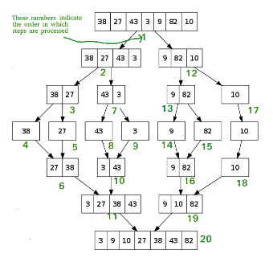

# T2A1-B

## Identify and explain the workings of TWO sorting algorithms and discuss and compare their performance/efficiency (i.e. Big O).
## Merge Sort
Merge Sort is a divide-and-conquer algorithm that efficiently sorts an array by recursively dividing it into smaller subarrays, sorting each half and then merging the sorted halves back together.  This process continues until the whole array is sorted.  

### Steps
1. Divide:
    - The array is recursively split into two halves until each sub-array contains only a single element, as a single element is trivially sorted. This results in a series of sub-arrays of one size.  

2. Conquer:
    - This is where the merging takes place.  During merging, two adjacent sorted arrays are combined into a single sorted array. This is done by repeatedly comparing the smallest unmerged elements of each sub-array and selecting the smaller element, placing it into a temporary array. This continues until one of the sub-arrays is exhausted. At this point, any remaining elements in the other sub-array are directly copied into the temporary array, as they are already sorted.  

3. Combine:
    - The last step involves combining these sorted arrays into larger and larger segments until the entire array is sorted. This process ensures that at each stage, the arrays being merged are sorted, leading to the final sorted array.

**Merge Sort Illustration**  

  

### Efficiency (Big O Notation)
1. Time Complexity:
    - The **Best Case, Average Case and Worst Case**: *O(n log n)*  
        * Due to Merge Sorts' divide and conquer approach, it consistently has a time complexity of *O(n log n) in all cases.  
            - **Divide:** The array is divided into two halves which is done in *O(log n)* stages(each time dividing the array size by two).
            - **Conquer and Combine:** Sorting and merging the divided arrays take *O(n)* time for each level of the recursion, as merging two sorted arrays requires comparing each element from both arrays once.  

Regardless of the initial order of the array, merge sort will always perform *O(n log n)* operations.  

## Insertion Sort  

### References
* https://www.geeksforgeeks.org/merge-sort/
* https://www.geeksforgeeks.org/merge-sort-vs-insertion-sort/
* https://www.youtube.com/watch?v=cVZMah9kEjI
* https://www.geeksforgeeks.org/analysis-of-different-sorting-techniques/

## Identify and explain the workings of TWO search algorithms and discuss and compare their performance/efficiency (i.e. Big O).
