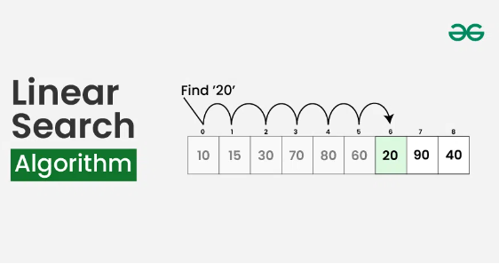
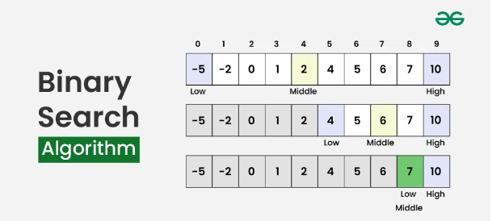

# NathanKeen_T2A1-B

## Q1
## Merge Sort
Merge Sort is a divide-and-conquer algorithm that sorts an array efficiently by recursively splitting it into smaller subarrays, sorting each half, and then merging the sorted halves back together. This process repeats until the entire array is sorted.  

### Steps
1. Divide:
    - The array is recursively divided into two halves until each sub-array contains just a single element, since a single element is inherently sorted. This results in a series of sub-arrays, each of size one.  

2. Conquer:
    - This is where the merging takes place.  During merging, two adjacent sorted arrays are combined into a single sorted array. This is done by repeatedly comparing the smallest unmerged elements of each sub-array and selecting the smaller element, placing it into a temporary array. This continues until one of the sub-arrays is exhausted. At this point, any remaining elements in the other sub-array are directly copied into the temporary array, as they are already sorted.  

3. Combine:
    - The last step involves combining these sorted arrays into larger and larger segments until the entire array is sorted. This process ensures that at each stage, the arrays being merged are sorted, leading to the final sorted array.

**Merge Sort Illustration**  

  

### Efficiency (Big O Notation)
1. Time Complexity:
    - The **Best Case, Average Case and Worst Case**: *O(n log n)*  
        * Due to Merge Sorts' divide and conquer approach, it consistently has a time complexity of *O(n log n) in all cases.  
            - **Divide:** The array is divided into two halves which is done in *O(log n)* stages(each time dividing the array size by two).
            - **Conquer and Combine:** Sorting and merging the divided arrays take *O(n)* time for each level of the recursion, as merging two sorted arrays requires comparing each element from both arrays once.  

Regardless of the initial order of the array, merge sort will always perform *O(n log n)* operations.  

2. Space Complexity:  
    - Merge Sort needs O(n) extra space to store the divided parts of the array and the merge results.  

## Insertion Sort  
Insertion sort is a straightforward comparison-based sorting algorithm that constructs the final sorted array incrementally, by placing each element in its correct position relative to the elements that have already been sorted. This process is similar to organising playing cards in your hand, where you insert each new card into the appropriate spot among the already arranged cards.

### Steps  
1. You start the with the second element of the array, because it is assumed that the first element in the array is already sorted.  
2. Compare the second element with the first element to check if the second is smaller than the first, if it is then it is swapped.  
3. Next we move onto the third element and compare it with the second, then the first and it is swapped if the element is in the correct position.  
4. This process is continued, comparing each element with the ones before it and swapping it into place when it is in the correct position.  This process is repeated until the whole array is sorted.  

**Insertion Sort Illustration**  

  

### Efficiency (Big O Notation)  
1. Time Complexity:  
    - The **Best Case:** O(n) If the array is already sorted.  
    - The **Average Case:** O(n²) When the Array is in a random order.  
    - The **Worst Case:** O(n²) If the array is in reverse order.  
2. Space Complexity:  
    - Insertion sort riquires O(1) of additional space, as it only reqires a constant amount of extra space.

## Comparison of Performance/Efficiency  
### Time complexity (Merge VS Insertion)
* Merge Sort has a better time complexity of O(n log n) across all cases, which makes it more preferable for large datasets.  
* Insertion Sort, with its O(n²) time complexity in the worst case, is less efficient for large datasets but can be faster for small datasets or nearly sorted data due to its O(n) best-case complexity.  

### Space Complexity (Merge VS Insertion)
* Merge Sort necessitates additional memory space proportional to the size of the input array, denoted as O(n).    
* Insertion Sort operates in-place and needs only O(1) additional space.  

### Use Cases (Merge VS Insertion)
* Merge Sort is suitable for large datasets or when a stable sort with consistent performance is needed.  
* Insertion Sort is often used for small datasets or nearly sorted datasets.  

In summary, Merge Sort is more efficient for larger datasets, while Insertion Sort can be more effective for smaller or nearly sorted data, despite its higher average time complexity.

### References
* GeeksforGeeks. (2018, October 31). Merge Sort - GeeksforGeeks. GeeksforGeeks. https://www.geeksforgeeks.org/merge-sort/
* Merge Sort vs. Insertion Sort. (2020, June 12). GeeksforGeeks. https://www.geeksforgeeks.org/merge-sort-vs-insertion-sort/
* Merge Sort In Python Explained (With Example And Code). (n.d.). Www.youtube.com. https://www.youtube.com/watch?v=cVZMah9kEjI
* Analysis of different sorting techniques - GeeksforGeeks. (2018, January 29). GeeksforGeeks. https://www.geeksforgeeks.org/analysis-of-different-sorting-techniques/
* Merge Sort in Python. (2019, December 12). Stack Abuse. https://stackabuse.com/merge-sort-in-python/
* Insertion Sort Algorithm. (2013, March 7). GeeksforGeeks. https://www.geeksforgeeks.org/insertion-sort-algorithm/

## Q2
## Linear Search 
Linear Search is a simple and straightforward algorithm that involes traversing each element in an array or list one by one until the target element is found or the entire list is traversed.  It is also known as Sequntial Search.  

### Steps 
1. Start at the first element of the array.  
2. The element is then compared with the target element.  If the current element is equal to the target, the search is successful, and the index of the element is returned.  If the current element is not equal to the target, then the algorithm moves to the next element in the list.  
3. This process is continued, moving from one element to the next sequentially.  
4. If the list is traversed to the end without finding the target, the algorithm concludes that the element is not present and returns a value that indicates the absence of the target (often -1 or null).  

**Linear Search Illustration**  
  

### Efficiency (Big O Notation)  
1. Time Complexity:  
    - **Best Case** O(1) if the element is found at the first position in the list.  
    - **Average Case** O(n) if the target is located somewhere in the middle of the list.  
    - **Worst Case** O(n) if the target element is located at the opposite end from where the seach started from.  

2. Space Complexity:  
    - Linear search requires only a constant amount of extra memory for a variable to iterate though the list O(1).  

## Binary Search  
Binary search is an efficient algorithm used to find a target value in an array but only if the array is sorted.  The basic idea is to divide the search interval in half repeatedly until the target is found or the interval is empty.  

### Steps  
1. Start by finding the middle index of the array.  
2. Compare the middle element with the target element. If they are equal, the search is successful, and the index of the middle element is returned. If the middle element is greater than the target, continue the search on the left side of the array. If the middle element is smaller, proceed with the search on the right side.  
3. This process of halving and comparing the middle element of the leftover array is continued until the target is found or the total search space is exhausted.  

**Binary Search Illustration**  
  

### Efficiency (Big O Notation)  
1. Time Complexity:  
    - **Best Case** O(1) if the target element is in the middle of the array on the first check.  
    - **Average Case** O(log n) The size of the search space is halved with each step, resulting in a logarithmic time complexity.
    - **Worst Case** O(log n) Even in the worst case, the search intervals is repeatedly halved, resulting in a logarithmic time complexity.

2. Space Complexity:  
    - O(1) or for the recursive version O(log n) of additional space is used.  

## Comparison of Performance/Efficiency  
### Time complexity (Merge VS Insertion)
* Linear Search has O(n) in the worst case, making it very inefficient for large datasets as it requires have to check each element.  
* Binary Search has O(log n) in the worst case, which makes it much more efficient for large datasets as it reduces the search space exponentially.  

### Applicability  
* Whether the array is sorted or not, Linear Search can be used on any dataset.  
* Binary Search on the otherhand, can only be used if the dataset is sorted.  If the data is not sorted, it needs to be sorted first which will add to the time complexity.  

### Use Cases (Merge VS Insertion)  
* Linear Search is suitable for small datasets or in cases where data is not sorted and the overhead of sorting is not justified.  
* Binary Search is ideal for large, sorted datasets where fast retrieval is critical, such as database queries or large collections of data.  \

In conclusion, Linear Search is simple and versitile but becomes inefficient as the size of the dataset increases.  Binary Search, on the other hand, is highly efficient for large datasets but requires the data be sorted beforehand.  Understanding the pros and cons of these two algorithms is crucial when it comes to selecting the right one for the problem at hand.  

### References 
* Linear Search vs Binary Search - GeeksforGeeks. (2016, October 20). GeeksforGeeks. https://www.geeksforgeeks.org/linear-search-vs-binary-search/
* GeeksforGeeks. (2019, April). Binary Search - GeeksforGeeks. GeeksforGeeks. https://www.geeksforgeeks.org/binary-search/
* GeeksforGeeks. (2019, February). Linear Search - GeeksforGeeks. GeeksforGeeks. https://www.geeksforgeeks.org/linear-search/
* Scott, T. (2020). How Binary Search Makes Computers Much, Much Faster. In YouTube. https://www.youtube.com/watch?v=KXJSjte_OAI